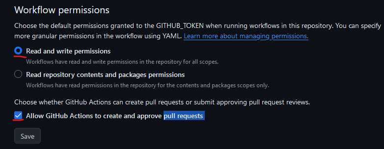

# Mips's plugin-translations workflow

A GitHub action to automatically generate translation files for your plugins and optionally automatically translated texts if all languages you want.

## How it works

The idea is to trigger a new workflow with this Github action on each push to a branch on your repository (dev or beta branch, as you prefer).
This workflow will:

- build a list of existing translations based on existing json translation files (i18n) that exist in your plugin, if any;
- enrich this list with existing translation in jeedom Core (in order to get a good base);
- parse your source files (`.php`, `.json` and `.js`) located in sub-directories `core`, `desktop` and `plugin_info` (and sub-directories of these of course);
- translate all texts found with the help of previous existing translations found;
- optional: call [deepl api](https://www.deepl.com) to translate automatically remaining texts, please create a free account on <https://www.deepl.com> for this, it's free for 500.000 chars by month which should be more than enough for 50 new plugins or more by month;
- generate new translations files (i18n) for selected target languages;
- adapt info.json file with list of target languages if needed;
- Automatically create a branch called `translations` and push changes in it (or adapt files if branch exists already);
- create a pull request to you need to approve to commit in the changes in the base branch (from where the workflow ran). So you can run it without risk, workflow will not changes anything without your final review!

## Quick start

### Permissions settings

First, you must grant Github actions write permission and allow to create pull requests. To do this, go to your repository `settings`, `Actions` tab and then `General`.


On the bottom of the page you will see corresponding permissions settings:



Do not forget to save changes.

### Basic workflow

Create a ´.github/workflows/translations.yml´ file in your repository and put the following content:

```YAML
name: translate

on:
  workflow_dispatch:
  push:
    branches:
      - beta

jobs:
  auto-translate:
    runs-on: ubuntu-latest
    steps:
      - uses: Mips2648/plugins-translations@v0.22
```

Save it and commit in your beta branch.

It will immediately run and generate translations file for your plugin for following language: de_DE, en_US & es_ES, push changes if any in a new branch `translations` of your repository and create a pull request that you can review and eventually validate. It couldn't be easier ;-)

## Optional input parameters

If you use a compatible editor like vscode, when editing the workflow you should be able to get auto-completion for options.
As any github action, you should use the `with:` keyword for optional input parameter as follow:

```YAML
name: translate

on:
  workflow_dispatch:
  push:
    branches:
      - beta

jobs:
  auto-translate:
    runs-on: ubuntu-latest
    steps:
      - uses: Mips2648/plugins-translations@v0.22
        with:
          deepl_api_key: ${{ secrets.DEEPL_API_KEY }}
          include_empty_translation: false
```

All inputs are **optional**. If not set, defaults values will be used.

| Name | Description | type | Default |
| --- | --- | --- | --- |
| `source_language` | Source language for translations, must be one of the following value: `fr_FR`, `en_US`, `es_ES`, `de_DE` *(not fully supported)* | `string` | `fr_FR` |
| `deepl_api_key` | [deepl API KEY](https://www.deepl.com) for automatic translation; If provided, missing translations will be automatically translated using deepl API. Please create a free account on <https://www.deepl.com> | `string` | '' |
| `include_empty_translation` | Include prompts without translation language files | `boolean` | `true` |
| `use_core_translations` | Tool will use translations from Jeedom core for missing plugin translations (before calling deepl api if available) | `boolean` | `true` |
| `generate_source_language_translations` | The translation file corresponding to the source language will be generated (which is useless) | `boolean` | `false` |
| `debug` | Set log level to debug | `boolean` | `true` |

### source_language

Currently not compatible with core translations but should be ok regarding existing plugin translations and automatic translation with help of *deepl api*

### deepl_api_key

If provided, all your prompts will be translated!

### include_empty_translation

This is preferable to have this params deactivated but if you want to be able to manually translate, then you need this.
This param is useless if you provide a valid *deepl API key* because all your translations will be completed (unless you reach the limit)

### use_core_translations

It is relevant to use core translations by default for coherence in user interface but if you don't trust or don't like them, you can deactivate this feature.

### generate_source_language_translations

Why would you use this feature? It is completely useless :-)

### debug

Because issues happen.
